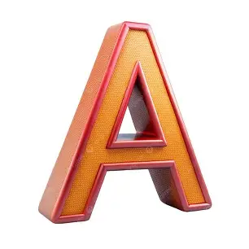
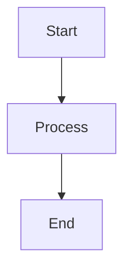

# Heading 1
## Heading 2
### Heading 3
#### Heading 4
##### Heading 5
###### Heading 6

**Bold**  
*Italic*  
***Bold + Italic***  
~~Strikethrough~~  
`Inline code`  

### Unordered Lists
- Item 1
- Item 2
  - Nested item
  - Nested item

### Ordered Lists
1. First
2. Second
3. Third

### Links 
[OpenAI](https://openai.com)
  
### Images



### Block quotes
> This is a quote
>> Nested quote

### Code
```python
def hello():
    print("Hello world")
```

```javascript
const variable_guy = 1;
```


```markdown
Im a gay box.
```
### Horizontal Line
---


### Table
| Name | Age | Role |
|------|-----|------|
| Matt | 40  | Dev  |
| Luz  | 40  | Wife |

| Left | Center | Right |
|:-----|:------:|------:|
| A    | B      | C     |


### Escaping characters
\*not italic\*
\# not heading


### HTML markdown
<b>Bold</b>  
<br>
<sub>Subscript</sub>  
<sup>Superscript</sup>  

  
### Collapsable section
  <details>
  <summary>Click me</summary>

Hidden content here

</details>  
<br>  



### Quick Reference

| Want | Syntax |
|------|--------|
| Bold | `**text**` |
| Italic | `*text*` |
| Code | `` `code` `` |
| Link | `[text](url)` |
| Image | `` |
| Quote | `> text` |
| Bullet list | `- item` |
| Numbered list | `1. item` |
| Checkbox | `- [ ]` |
| Heading | `# heading` |
| Table | `| col | col |` |
| Code block | ``` ``` |
| Horizontal line | `---` |

If you're using Markdown specifically for GitHub, Discord, Jupyter notebooks, or Obsidian, I can give you a version tailored to that renderer.